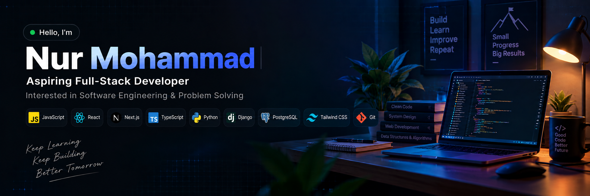

<!-- ======================= Banner ======================= -->

  

 

<!-- ======================= Title ======================= -->

  <ul align="center">
    

      <h1 style="display: inline-block">Hi 👋, I'm Nur Mohammad</h1>
    

  </ul>

 

<!-- ======================= About Me ======================= -->

👋 Hi, I'm **Nur Mohammad**

🖥️ I'm currently **learning React, Next.js, TypeScript and Full-Stack Web Development.**

🗄️ I have experience working with **Python, Django, Django REST Framework and PostgreSQL.**

🛠️ I'm currently improving my skills in Software Engineering, Problem Solving and modern web development.

💬 Ask me about **React, Next.js, TypeScript, Python, Django and REST APIs.**

🌐 Explore My Portfolio and Resume.

📝 I share my learning and projects on LinkedIn.

📫 Feel free to reach me at nurmohammad6465@gmail.com.

 

<!-- ======================= Socials ======================= -->

<b> FOLLOW ME ON SOCIALS:</b>

  

    
    
  

 

<!-- ======================= Technology Stack ======================= -->

## 💜 TECHNOLOGY STACK:

### Languages:

  
  
  
  
  
  

### CSS Frameworks & Libraries:

  
  
  

### JavaScript Frameworks & Libraries:

  
  
  
  
  
  

### Database & Model:

  
  
  
  
  

### Deployment Platform:

  
  
  

### Design & Graphics:

  
  
  

### Tools & Technologies:

  
  
  
  
  
  
  
  

  

### 🐍 GITHUB CONTRIBUTIONS:

  

 

<!-- ======================= Profile Views ======================= -->

  

